# 微信公众号文章导出工具 (wechat-article-exporter)

## 项目概述

这是一个基于 Node.js 和 Vue 3 的在线微信公众号文章批量下载工具，支持导出阅读量与评论数据。该项目提供了完整的 Web 界面，用户可以通过浏览器直接使用，无需安装任何软件。同时支持 Docker 私有化部署和 Cloudflare 部署。

**版本**: 2.3.3
**技术栈**: Nuxt 3 + Vue 3 + TypeScript + Tailwind CSS + AG-Grid

## 核心功能

- ✅ **搜索公众号** - 支持关键字搜索公众号
- ✅ **多格式导出** - 支持 HTML/JSON/Excel/TXT/Markdown/DOCX 格式导出
  - HTML 格式可 100% 还原文章排版与样式（包含图片和样式文件）
- ✅ **数据缓存** - 缓存文章列表数据，减少接口请求次数
- ✅ **高级筛选** - 支持按作者、标题、发布时间、原创标识、所属合集等过滤
- ✅ **合集下载** - 支持下载公众号合集
- ✅ **多媒体支持** - 支持图片、视频、音频、文本分享消息
- ✅ **评论数据** - 支持导出评论、评论回复、阅读量、转发量等数据（需要配置 credentials）
- ✅ **开放 API** - 提供 RESTful API 接口
- ✅ **多部署方式** - 支持 Docker、Cloudflare Pages 等部署方式

## 技术架构

### 前端技术栈
- **Nuxt 3** - Vue 3 全栈框架
- **Vue 3** - 前端框架，使用 Composition API
- **TypeScript** - 类型安全
- **Tailwind CSS** - 原子化 CSS 框架
- **Nuxt UI** - UI 组件库
- **AG-Grid Enterprise** - 数据表格组件
- **Dexie** - IndexedDB 封装，用于客户端数据存储
- **VueUse** - Vue 组合式工具集
- **Monaco Editor** - 代码编辑器

### 后端技术栈
- **Nitro** - Nuxt 3 的服务器引擎
- **H3** - HTTP 框架
- **Node.js 22+** - 运行时环境

### 数据存储
- **IndexedDB (Dexie)** - 客户端数据持久化
  - 存储文章缓存、账号信息、API 调用记录等
- **KV Storage** - 服务器端存储（可选）
  - 支持内存存储或文件系统存储

## 模块结构图

```mermaid
graph TD
    A["(根) wechat-article-exporter"] --> B["apis"]
    A --> C["components"]
    A --> D["composables"]
    A --> E["config"]
    A --> F["pages"]
    A --> G["server"]
    A --> H["shared"]
    A --> I["store/v2"]
    A --> J["types"]
    A --> K["utils"]
    A --> L["assets"]
    A --> M["public"]
    A --> N["samples"]

    B --> B1["index.ts - API调用封装"]

    C --> C1["api - API相关组件"]
    C --> C2["base - 基础组件"]
    C --> C3["dashboard - 仪表板组件"]
    C --> C4["global - 全局组件"]
    C --> C5["grid - 表格相关组件"]
    C --> C6["modal - 模态框组件"]
    C --> C7["preview - 预览组件"]
    C --> C8["search - 搜索组件"]
    C --> C9["selector - 选择器组件"]
    C --> C10["setting - 设置组件"]

    D --> D1["useExporter.ts - 导出功能"]
    D --> D2["useLoginAccount.ts - 登录账号管理"]
    D --> D3["useBatchDownload.ts - 批量下载"]
    D --> D4["toast.ts - 消息提示"]

    E --> E1["index.ts - 主配置"]
    E --> E2["proxy.txt - 代理配置"]
    E --> E3["shared-grid-options.ts - 表格配置"]

    F --> F1["dashboard - 仪表板页面"]
    F --> F2["dev - 开发页面"]
    F --> F3["index.vue - 首页"]

    G --> G1["api - API路由"]
    G --> G2["utils - 服务端工具"]
    G --> G3["kv - KV存储"]

    H --> H1["utils - 共享工具函数"]

    I --> I1["db.ts - 数据库定义"]
    I --> I2["article.ts - 文章存储"]
    I --> I3["info.ts - 账号信息存储"]
    I --> I4["comment.ts - 评论存储"]

    J --> J1["types.d.ts - 通用类型"]
    J --> J2["article.d.ts - 文章类型"]
    J --> J3["account.d.ts - 账号类型"]

    K --> K1["download - 下载相关"]
    K --> K2["article - 文章处理"]
    K --> K3["exporter.ts - 导出工具"]

    click B1 "./apis/CLAUDE.md" "查看 apis 模块文档"
    click C1 "./components/api/CLAUDE.md" "查看 api 组件文档"
    click C2 "./components/base/CLAUDE.md" "查看 base 组件文档"
    click C3 "./components/dashboard/CLAUDE.md" "查看 dashboard 组件文档"
    click F1 "./pages/dashboard/CLAUDE.md" "查看 dashboard 页面文档"
    click G1 "./server/api/CLAUDE.md" "查看 API 路由文档"
    click I1 "./store/v2/CLAUDE.md" "查看数据存储文档"
```



## 项目结构

```
wechat-article-exporter/
├── apis/                     # API 调用封装
│   └── index.ts             # 文章和账号相关 API
├── assets/                   # 静态资源
│   ├── logo.svg
│   └── *.png                # 图片资源
├── components/               # Vue 组件
│   ├── api/                 # API 相关组件
│   ├── base/                # 基础组件
│   ├── dashboard/           # 仪表板组件
│   ├── global/              # 全局组件
│   ├── grid/                # 表格相关组件
│   ├── modal/               # 模态框组件
│   ├── preview/             # 预览组件
│   ├── search/              # 搜索组件
│   ├── selector/            # 选择器组件
│   └── setting/             # 设置组件
├── composables/             # 组合式函数
│   ├── useExporter.ts       # 导出功能
│   ├── useLoginAccount.ts   # 登录账号管理
│   └── ...
├── config/                  # 配置文件
│   ├── index.ts             # 主配置
│   ├── proxy.txt            # 代理配置
│   └── shared-grid-options.ts # 表格配置
├── pages/                   # 页面路由
│   ├── dashboard/           # 仪表板页面
│   │   ├── account.vue      # 账号管理
│   │   ├── article.vue      # 文章管理
│   │   ├── album.vue        # 合集管理
│   │   ├── api.vue          # API 文档
│   │   └── settings.vue     # 设置页面
│   ├── dev/                 # 开发页面
│   └── index.vue            # 首页
├── server/                  # 服务端代码
│   ├── api/                 # API 路由
│   │   ├── public/          # 公开 API
│   │   └── web/             # 需要认证的 API
│   ├── kv/                  # KV 存储相关
│   └── utils/               # 服务端工具
├── shared/                  # 前后端共享代码
│   └── utils/               # 共享工具函数
├── store/                   # 数据存储
│   └── v2/                  # 使用 Dexie 的存储层
├── types/                   # TypeScript 类型定义
├── utils/                   # 工具函数
│   ├── download/            # 下载相关
│   ├── article/             # 文章处理
│   └── ...
├── samples/                 # 示例文件
├── app.vue                  # 根组件
├── nuxt.config.ts          # Nuxt 配置
├── package.json            # 项目依赖
├── Dockerfile              # Docker 配置
└── README.md               # 项目说明
```

## 开发指南

### 环境要求
- Node.js 22+
- Yarn 1.22.22+ (推荐使用 Yarn)

### 安装依赖
```bash
yarn install
```

### 开发命令
```bash
# 启动开发服务器
yarn dev

# 调试模式（支持 Node.js Inspector）
yarn debug

# 构建生产版本
yarn build

# 预览生产版本
yarn preview

# 代码格式化
yarn format
```

### 环境变量配置

创建 `.env` 文件配置以下环境变量：

```env
# AG-Grid 许可证密钥
NUXT_AGGRID_LICENSE=your_aggrid_license

# Sentry 错误监控
NUXT_SENTRY_DSN=your_sentry_dsn
NUXT_SENTRY_ORG=your_sentry_org
NUXT_SENTRY_PROJECT=your_sentry_project
NUXT_SENTRY_AUTH_TOKEN=your_sentry_auth_token

# Umami 统计
NUXT_UMAMI_ID=your_umami_id
NUXT_UMAMI_HOST=your_umami_host

# 遥测（可选）
NUXT_TELEMETRY=true
NUXT_TELEMETRY_URL=your_telemetry_url
```

## 核心功能实现

### 1. 登录认证流程
- 扫码登录获取微信公众号 session
- 使用 Cookie 存储登录状态
- 支持多账号管理

### 2. 文章抓取机制
- 利用公众号后台的文章搜索功能
- 分页加载文章列表（每页 20 条）
- 智能缓存减少重复请求

### 3. 导出功能
- **HTML 导出**: 下载并打包所有资源，完整还原文章样式
- **Excel 导出**: 导出文章元数据（标题、作者、发布时间、阅读量等）
- **JSON 导出**: 导出结构化数据
- **Markdown/Word**: 转换文章内容为相应格式

### 4. 数据存储
使用 Dexie（IndexedDB）实现以下存储：
- `article`: 文章缓存
- `info`: 账号信息
- `comment`: 评论数据
- `html`: HTML 内容缓存
- `asset`: 资源文件缓存

## API 接口

### 公开 API（无需认证）
- `GET /api/public/v1/account` - 搜索公众号
- `GET /api/public/v1/article` - 获取文章列表
- `GET /api/public/v1/download` - 下载文章

### Web API（需要认证）
- `GET /api/web/login/getqrcode` - 获取登录二维码
- `GET /api/web/login/scan` - 扫码状态检查
- `GET /api/web/mp/searchbiz` - 搜索公众号
- `GET /api/web/mp/appmsgpublish` - 获取文章列表
- `GET /api/web/misc/comment` - 获取评论

## 部署指南

### Docker 部署
```bash
# 构建镜像
docker build --build-arg VERSION=2.3.3 -t wechat-article-exporter:2.3.3 .

# 运行容器
docker run -p 3000:3000 wechat-article-exporter:2.3.3
```

### Cloudflare Pages 部署
```bash
# 构建并部署到 Cloudflare Pages
yarn build
npx wrangler pages dev dist
```

## 注意事项

1. **浏览器兼容性**: 推荐使用 Chrome 浏览器以获得最佳体验
2. **API 限制**: 遵守微信公众号的 API 调用频率限制
3. **数据隐私**: 用户的登录信息仅用于自身账号的文章抓取，不会共享
4. **版权声明**: 导出的文章内容版权归原作者所有，请合理使用

## 相关链接

- **在线使用**: https://down.mptext.top
- **文档站点**: https://docs.mptext.top
- **GitHub 仓库**: https://github.com/wechat-article/wechat-article-exporter
- **交流群**: QQ 991482155

## 许可证

MIT License - 详见 [LICENSE](LICENSE) 文件

## 变更记录 (Changelog)

### 2025-12-08 12:19:14
- 初始化 AI 上下文文档
- 添加模块结构图（Mermaid）
- 完善项目架构说明
- 标识各模块职责与入口文件