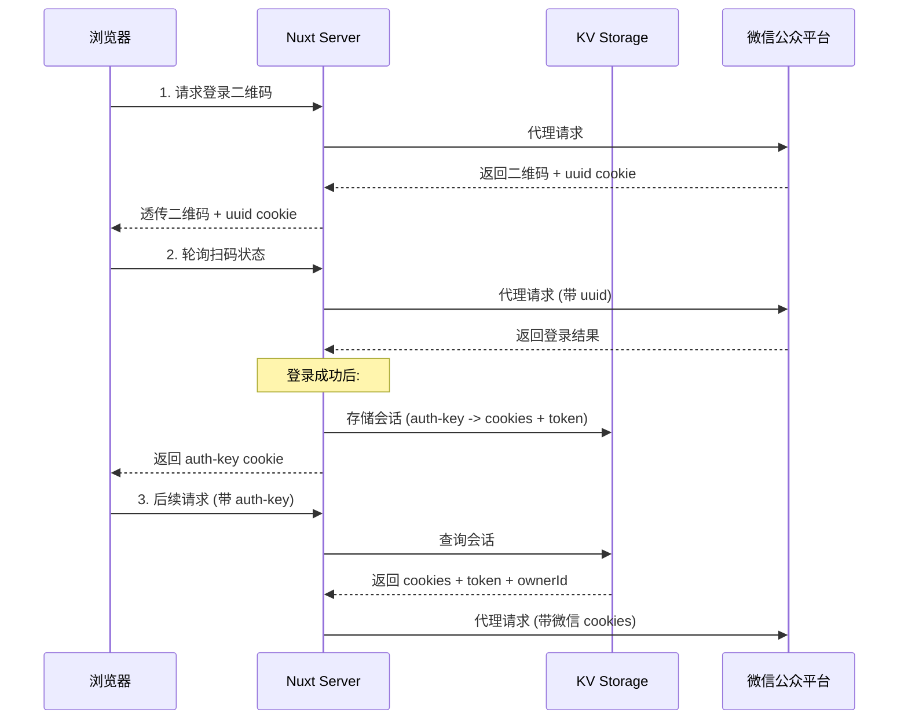

# 登录与会话管理架构设计文档

## 1. 概述

本系统使用**代理登录模式**，通过服务端代理微信公众号平台的登录请求，实现用户身份验证和会话管理。核心目标是：
- 安全地代理微信公众号登录
- 持久化用户会话（跨服务器重启）
- 支持多账号数据隔离

---

## 2. 架构图



---

## 3. 核心组件

### 3.1 关键文件

| 文件路径 | 职责 |
|---------|------|
| `server/utils/proxy-request.ts` | 代理微信请求，处理登录流程 |
| `server/utils/CookieStore.ts` | 会话存储管理类 |
| `server/kv/cookie.ts` | KV 存储操作（持久化） |
| `server/api/web/login/bizlogin.post.ts` | 登录 API，计算 ownerId |
| `composables/useLoginAccount.ts` | 前端登录状态管理 |
| `nuxt.config.ts` | KV 存储驱动配置 |

### 3.2 关键数据结构

```typescript
// KV 存储的会话数据结构
interface CookieKVValue {
  token: string;           // 微信公众号 token
  cookies: CookieEntity[]; // 微信返回的所有 cookies
  ownerId?: string;        // 登录账号标识 (nick_name 的 MD5)
  createdAt?: number;      // 会话创建时间戳（用于过期检查）
}

// 单条 Cookie 解析结果
interface CookieEntity {
  name: string;
  value: string;
  expires?: string;
  expires_timestamp?: number;
  path?: string;
  domain?: string;
  httponly?: string;
  secure?: string;
}
```

---

## 4. 登录流程详解

### Step 1: 获取登录二维码
- **API**: `POST /api/web/login/prelogin`
- **流程**: 
  1. 服务端代理请求微信的 `startlogin` 接口
  2. 微信返回二维码 URL 和 `uuid` cookie
  3. 服务端透传 `uuid` cookie 给浏览器（开发环境移除 `Secure` 属性）

### Step 2: 轮询扫码状态
- **API**: `POST /api/web/login/ask`
- **流程**: 前端轮询等待用户扫码

### Step 3: 完成登录
- **API**: `POST /api/web/login/bizlogin`
- **流程**:
  1. 代理微信 `bizlogin` 请求
  2. 微信返回 `token` 和多个 `set-cookie`
  3. 生成唯一 `auth-key`（UUID 格式）
  4. 调用 `cookieStore.setCookie()` 存储会话到 KV
  5. 获取用户 `nick_name`，计算 `ownerId = MD5(nick_name)`
  6. 调用 `cookieStore.setOwnerId()` 存储 ownerId
  7. 返回 `auth-key` cookie 给浏览器

---

## 5. 会话持久化机制

### 5.1 KV 存储配置

```typescript
// nuxt.config.ts
nitro: {
  storage: {
    kv: {
      // 开发环境使用文件系统驱动，生产环境可配置
      driver: process.env.NITRO_KV_DRIVER || 
              (process.env.NODE_ENV === 'production' ? 'memory' : 'fs'),
      base: process.env.NITRO_KV_BASE || './.data/kv',
    },
  },
},
```

### 5.2 存储驱动选项

| 驱动 | 说明 | 适用场景 |
|-----|------|---------|
| `memory` | 内存存储（默认） | 生产环境（配合外部 KV） |
| `fs` | 文件系统存储 | 开发环境持久化 |
| `cloudflare-kv-binding` | Cloudflare KV | Cloudflare Workers 部署 |

### 5.3 过期机制

```typescript
// server/kv/cookie.ts
const SESSION_TTL_MS = 60 * 60 * 24 * 4 * 1000; // 4天

// 读取时检查过期
if (data.createdAt) {
  const elapsed = Date.now() - data.createdAt;
  if (elapsed > SESSION_TTL_MS) {
    await kv.remove(`cookie:${key}`);
    return null;
  }
}
```

---

## 6. 多账号数据隔离

### 6.1 ownerId 生成

```typescript
// server/api/web/login/bizlogin.post.ts
function computeOwnerId(nickName: string): string {
  return crypto.createHash('md5').update(nickName).digest('hex');
}
```

### 6.2 数据隔离查询

所有数据表的主键都包含 `owner_id`，确保不同账号的数据相互隔离：

```sql
-- 示例：查询文章
SELECT * FROM article WHERE owner_id = ? AND fakeid = ?;
```

### 6.3 从请求获取 ownerId

```typescript
// server/utils/CookieStore.ts
export async function getOwnerIdFromRequest(event: H3Event): Promise<string | null> {
  // 1. 优先从 header 读取
  let ownerId = getRequestHeader(event, 'X-Owner-Id');
  if (ownerId) return ownerId;

  // 2. 通过 auth-key 从 KV 读取
  const authKey = cookies['auth-key'];
  if (authKey) {
    ownerId = await cookieStore.getOwnerId(authKey);
  }
  return ownerId;
}
```

---

## 7. Cookie 传递流程

### 7.1 客户端 → 服务端

```
浏览器请求 Header:
Cookie: auth-key=abc123...
```

### 7.2 服务端处理

```typescript
// proxy-request.ts
const cookie = await getCookieFromStore(event);
// cookie = "slave_user=xxx; slave_sid=yyy; ..."
headers.set('Cookie', cookie);
```

### 7.3 服务端 → 微信

```
代理请求 Header:
Cookie: slave_user=xxx; slave_sid=yyy; bizuin=zzz; ...
```

---

## 8. 开发环境注意事项

### 8.1 HTTP vs HTTPS

开发环境使用 HTTP，需要移除 `Secure` 属性：

```typescript
// proxy-request.ts
if (isDev) {
  setCookies = [
    `auth-key=${authKey}; Path=/; Expires=...; HttpOnly`,
    // 注意：无 Secure 属性
  ];
}
```

### 8.2 会话持久化验证

```powershell
# 检查会话文件是否生成
Get-ChildItem ".data\kv" -Recurse
```

---

## 9. 故障排查

### 问题：重启后需要重新登录

1. 检查 KV 驱动配置是否为 `fs`
2. 检查 `.data/kv` 目录是否有文件
3. 检查 `.env` 是否覆盖了配置

### 问题：owner_id not found

1. 确认已重新登录（使用新配置）
2. 检查 `setOwnerId` 是否成功执行
3. 检查 KV 中的数据是否包含 `ownerId` 字段

### 问题：Cookie 不生效

1. 开发环境检查是否移除了 `Secure` 属性
2. 检查浏览器 DevTools → Application → Cookies

---

## 10. 相关 API 清单

| API 路径 | 方法 | 说明 |
|---------|------|------|
| `/api/web/login/prelogin` | POST | 获取登录二维码 |
| `/api/web/login/ask` | POST | 轮询扫码状态 |
| `/api/web/login/bizlogin` | POST | 完成登录 |
| `/api/public/v1/authkey` | GET | 验证 auth-key 有效性 |
| `/api/db/info` | GET | 获取公众号列表（需要 ownerId） |
| `/api/db/data` | POST | 通用数据 CRUD（需要 ownerId） |
